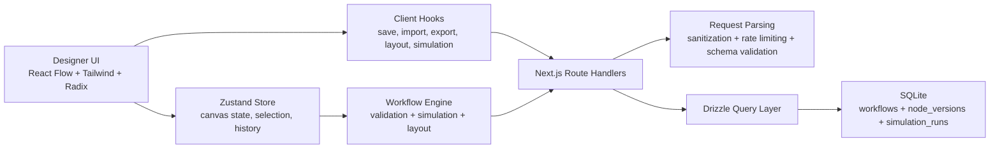

# NexusFlow

NexusFlow is a canvas-first workflow designer for building, validating, simulating, and saving business process flows. It is built with the Next.js App Router, React Flow, Zustand, Zod, Drizzle ORM, and SQLite, with a strong focus on polished UX, local-first productivity, and production-friendly deployment.

Production designer URL: [https://nexusflow.abhashchakraborty.tech/designer](https://nexusflow.abhashchakraborty.tech/designer)

Copyright © 2026 Abhash Chakraborty. All rights reserved.

## Overview

NexusFlow gives you a visual workflow canvas where you can:

- drag structured workflow steps onto a designer canvas
- connect nodes with guardrails and validation
- configure node details in a live editing panel
- simulate execution before saving
- persist workflows with optimistic locking
- restore recent node edits through snapshots
- import and export workflows as JSON
- run the whole app locally or through Docker

The project is intentionally organized so the workflow engine, persistence layer, and UI can evolve independently without turning the app into a single monolith of component logic.

## Screenshots

Add your product images here when ready:

- `docs/screenshots/designer-overview.png`
- `docs/screenshots/canvas-editing.png`
- `docs/screenshots/simulation-panel.png`
- `docs/screenshots/saved-workflows.png`

Existing example:


## Core Capabilities

### Workflow designer

- full-page workflow canvas with dotted background, zoom controls, minimap, and fullscreen support
- drag-and-drop node placement from the left rail
- starter workflow templates for quick graph bootstrapping
- undo and redo support for graph operations
- clear-canvas action for resetting the current graph without losing workflow metadata
- local draft persistence so refreshes do not wipe the current session

### Node types

- `Start`
- `Task`
- `Approval`
- `Automation`
- `End`

Each node type has its own display card, validation requirements, and editing form in the right inspector.

### Validation and simulation

- real-time workflow validation as nodes and edges change
- node-level validation badges rendered directly on the canvas
- graph-wide issue summary in the status bar
- simulation panel that blocks invalid flows from running
- deterministic traversal so previews are consistent and debuggable

### Persistence and recovery

- SQLite-backed workflow storage
- optimistic locking with workflow version numbers
- node snapshot history captured when node data changes
- draft recovery through browser storage for temporary in-progress work
- import/export support for portable workflow JSON

### API and platform features

- App Router route handlers for workflow CRUD and simulation
- shared JSON body parsing and schema validation
- text sanitization to reject unsupported control characters
- request throttling via Upstash Redis or in-memory fallback
- Docker runtime with migration bootstrap and production asset serving

## Stack

- Next.js 16 App Router
- React 19
- TypeScript strict mode
- Tailwind CSS v4
- Radix UI primitives
- React Flow 12
- Zustand with Immer middleware
- TanStack Query
- Zod
- Drizzle ORM
- SQLite via `better-sqlite3`
- Vitest
- Biome

## Architecture



## Repository Layout

```text
src/
  app/
    api/                 Route handlers for automations, simulation, and workflows
    designer/            Main designer route
  components/
    canvas/              Toolbar, canvas shell, sidebars, status bar, inspector
    forms/               Node-specific configuration forms
    history/             Snapshot history UI
    nodes/               Custom node renderers
    providers/           Query and toast providers
  constants/             Node config, starter templates, automation catalog
  hooks/                 Save/load/export/layout/history/simulation hooks
  lib/
    api/                 Shared API request and response helpers
    db/                  Drizzle schema, DB bootstrap, query modules
    workflow-*           Validation, simulation, persistence, schemas
  store/                 Zustand workflow store
  types/                 Shared workflow and API types
  ui/                    Reusable UI primitives
drizzle/
  migrations/            SQL migrations
scripts/
  migrate.mjs            Runtime migration bootstrap
  start.mjs              Production start wrapper
```

## Workflow Data Model

### `workflows`

Stores:

- workflow id
- name
- description
- persisted graph JSON
- version number
- node and edge counts
- validity flag
- created and updated timestamps

### `node_versions`

Stores recent per-node snapshots for:

- workflow id
- node id
- node type
- node data JSON
- label at capture time
- creation timestamp

### `simulation_runs`

Stores:

- workflow id
- graph snapshot JSON
- simulation result JSON
- duration
- success flag
- creation timestamp

## API Reference

### `GET /api/automations`

Returns the automation action catalog used by automation nodes and forms.

### `POST /api/simulate`

Validates a workflow graph, simulates execution, stores the run metadata, and returns the result payload.

### `GET /api/workflows`

Returns a lightweight list of saved workflows ordered by most recently updated.

### `POST /api/workflows`

Creates a workflow after request parsing, sanitization, schema validation, and graph validation.

### `GET /api/workflows/[id]`

Returns a saved workflow, its graph payload, version info, and node snapshot history. Corrupted persisted graph data is rejected safely instead of crashing the route.

### `PUT /api/workflows/[id]`

Updates a workflow using optimistic locking via `expectedVersion`. If the incoming version is stale, the route returns a `409 VERSION_CONFLICT`.

### `DELETE /api/workflows/[id]`

Deletes a workflow and cascades dependent node-version history through the database relationship.

## Local Development

### Prerequisites

- Node.js 22 or newer
- pnpm 10 or newer

### Install and run

```bash
pnpm install
cp .env.example .env.local
pnpm dev
```

The development script boots migrations before the Next.js server starts, so a fresh clone can be brought up with very little manual setup.

### Production build locally

```bash
pnpm build
pnpm start
```

`scripts/start.mjs` handles migration bootstrap and can run either the standalone server bundle or a regular `next start` fallback, depending on the build output available in the runtime image.

## Environment Variables

| Variable | Default | Description |
| --- | --- | --- |
| `DATABASE_URL` | `file:./data/nexusflow.db` | SQLite database file path |
| `RATE_LIMIT_REQUESTS` | `60` | Maximum requests allowed in each rate-limit window |
| `RATE_LIMIT_WINDOW_SECONDS` | `60` | Rate-limit window size in seconds |
| `UPSTASH_REDIS_REST_URL` | unset | Enables distributed rate limiting when provided |
| `UPSTASH_REDIS_REST_TOKEN` | unset | Upstash auth token |
| `NEXT_PUBLIC_APP_NAME` | `NexusFlow` | App name shown in metadata and UI |
| `NEXT_PUBLIC_APP_VERSION` | `1.0.0` | Product version shown in the interface |

When Upstash credentials are not configured, NexusFlow falls back to an in-memory limiter suitable for single-instance deployments and local development.

## Commands

```bash
pnpm dev
pnpm build
pnpm start
pnpm typecheck
pnpm lint
pnpm test
pnpm check
pnpm db:bootstrap
pnpm db:generate
pnpm db:migrate
pnpm db:push
pnpm db:seed
pnpm db:studio
```

## Docker

### Start the stack

```bash
cp .env.production.example .env.production
docker compose up --build
```

### Docker characteristics

- optimized multi-stage build with cached `pnpm fetch`
- production runtime copies only runtime dependencies
- migration bootstrap runs before the app starts
- static Next production assets are served reliably in the container
- SQLite data persists through the `nexusflow-data` volume
- runtime uses a non-root user

### Why the build is optimized

The Dockerfile is split into dependency, production-dependency, build, and runtime stages. Lockfile-driven dependency fetching is cached separately from application code, which keeps rebuilds faster when only source files change.

### Production compose usage

The provided `docker-compose.yml` expects a real `.env.production` file on the server.

Typical server flow:

```bash
cp .env.production.example .env.production
nano .env.production
docker compose up -d --build
docker compose ps
docker compose logs -f nexusflow
```

The compose stack keeps the app bound to `127.0.0.1:3000`, which is the recommended shape when you are running Nginx or Caddy on the same instance for TLS termination and public routing.

## Security Notes

- API bodies are size-limited before parsing
- malformed JSON is rejected with `400`
- unsupported control characters are rejected with `422`
- schema validation strips unknown fields
- API routes share a common error wrapper
- persisted workflow graphs are parsed and validated before being returned, which prevents corrupted DB rows from crashing the workflow route
- rate limiting is applied to `/api/*` requests

## Quality Gates

The expected healthy state for the repository is:

```bash
pnpm typecheck
pnpm lint
pnpm test
pnpm build
docker compose config
```

## Product and ownership

- Product: `NexusFlow`
- Owner: `Abhash Chakraborty`
- Production URL: [https://nexusflow.abhashchakraborty.tech/designer](https://nexusflow.abhashchakraborty.tech/designer)

If you add portfolio, product, or release screenshots later, keep the production URL and ownership attribution aligned with the metadata defined in the application shell.

## Contribution

See [CONTRIBUTING.md](./CONTRIBUTING.md) and [CODE_OF_CONDUCT.md](./CODE_OF_CONDUCT.md).
